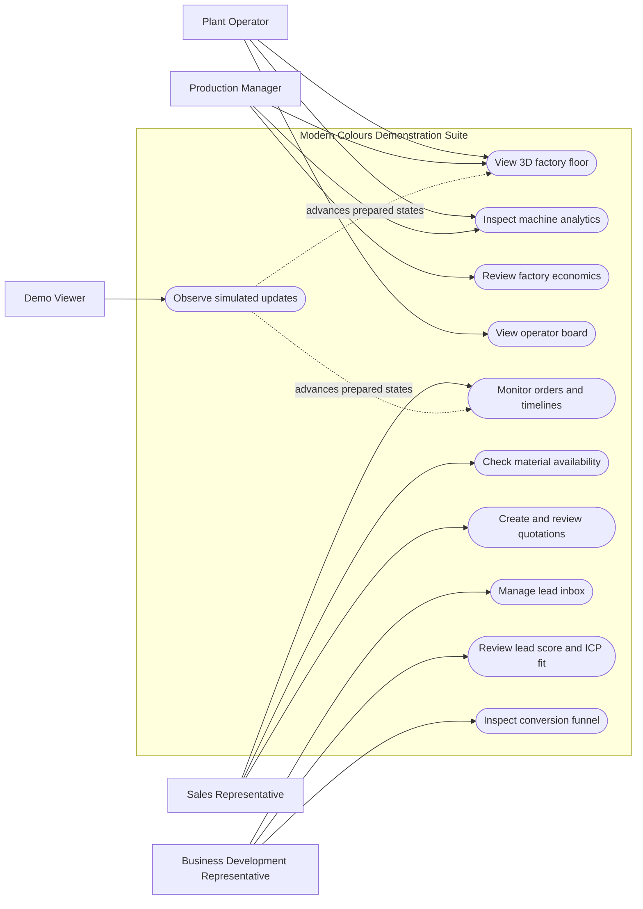

# Use-Case Diagram — Modern Colours Demonstration Suite

The three browser-based modules use prepared data and a simulated clock; they do not connect to live operational systems.

```mermaid
flowchart LR
    operator[Plant Operator]
    manager[Production Manager]
    sales[Sales Representative]
    bd[Business Development Representative]
    viewer[Demo Viewer]

    subgraph platform[Modern Colours Demonstration Suite]
        floor([View 3D factory floor])
        machine([Inspect machine analytics])
        economics([Review factory economics])
        board([View operator board])
        orders([Monitor orders and timelines])
        materials([Check material availability])
        quotes([Create and review quotations])
        inbox([Manage lead inbox])
        score([Review lead score and ICP fit])
        funnel([Inspect conversion funnel])
        timeline([Observe simulated updates])
    end

    operator --> floor
    operator --> machine
    operator --> board
    manager --> floor
    manager --> machine
    manager --> economics
    sales --> orders
    sales --> materials
    sales --> quotes
    bd --> inbox
    bd --> score
    bd --> funnel
    viewer --> timeline
    timeline -. advances prepared states .-> orders
    timeline -. advances prepared states .-> floor
```
