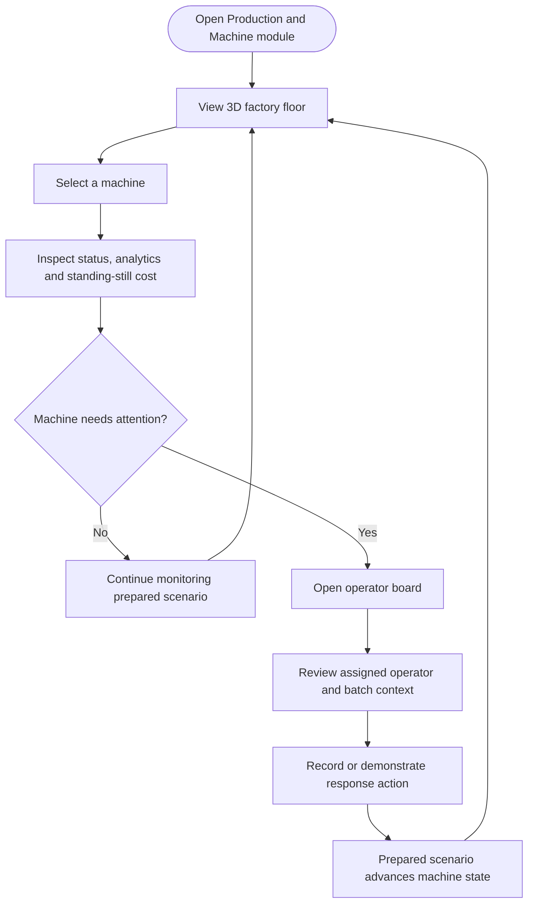

# Activity Diagram — Machine Monitoring and Response

```mermaid
flowchart TD
    start([Open Production and Machine module]) --> floor[View 3D factory floor]
    floor --> select[Select a machine]
    select --> analytics[Inspect status, analytics and standing-still cost]
    analytics --> issue{Machine needs attention?}
    issue -- No --> observe[Continue monitoring prepared scenario]
    observe --> floor
    issue -- Yes --> board[Open operator board]
    board --> review[Review assigned operator and batch context]
    review --> action[Record or demonstrate response action]
    action --> updated[Prepared scenario advances machine state]
    updated --> floor
```
