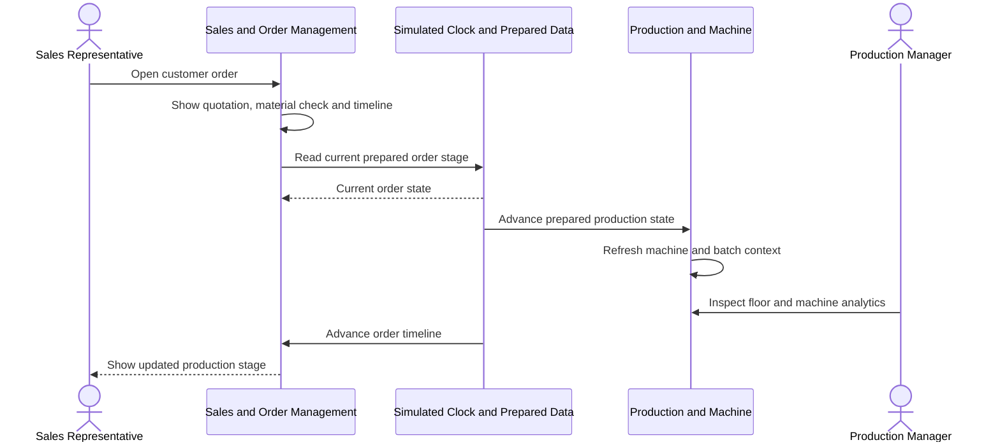

# Swimlane Diagram — Sales Order to Production Lifecycle

```mermaid
sequenceDiagram
    actor Sales as Sales Representative
    participant SalesApp as Sales and Order Management
    participant Scenario as Simulated Clock and Prepared Data
    participant Production as Production and Machine
    actor Manager as Production Manager

    Sales->>SalesApp: Open customer order
    SalesApp->>SalesApp: Show quotation, material check and timeline
    SalesApp->>Scenario: Read current prepared order stage
    Scenario-->>SalesApp: Current order state
    Scenario->>Production: Advance prepared production state
    Production->>Production: Refresh machine and batch context
    Manager->>Production: Inspect floor and machine analytics
    Scenario->>SalesApp: Advance order timeline
    SalesApp-->>Sales: Show updated production stage
```
