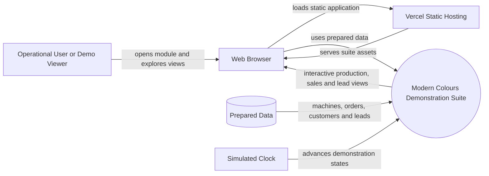

# DFD Level 0 — Demonstration Suite Context

```mermaid
flowchart LR
    user[Operational User or Demo Viewer]
    browser[Web Browser]
    system((Modern Colours Demonstration Suite))
    prepared[(Prepared Data)]
    clock[Simulated Clock]
    vercel[Vercel Static Hosting]

    user -->|opens module and explores views| browser
    browser -->|loads static application| vercel
    vercel -->|serves suite assets| browser
    browser -->|uses prepared data| system
    prepared -->|machines, orders, customers and leads| system
    clock -->|advances demonstration states| system
    system -->|interactive production, sales and lead views| browser
```
