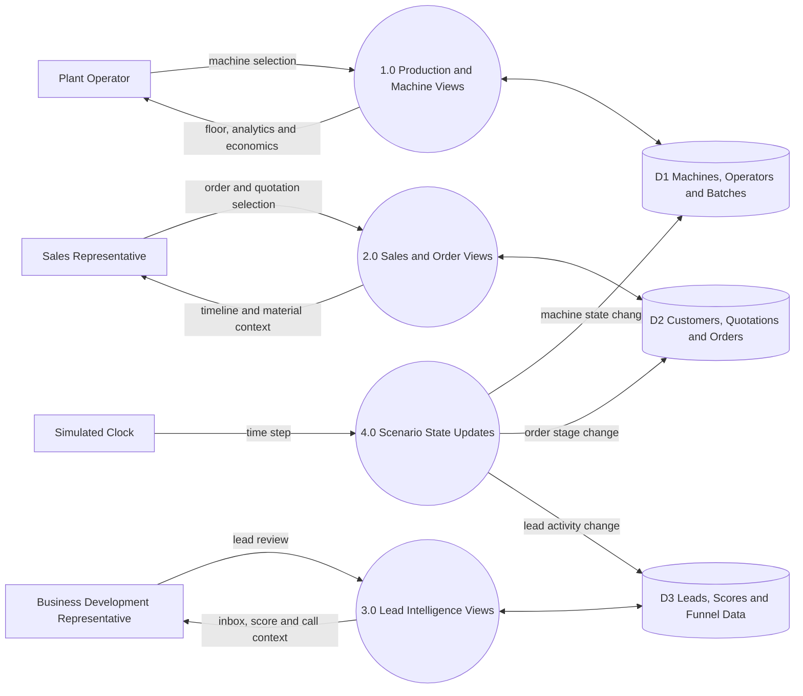

# DFD Level 1 — Core Demonstration Processes

```mermaid
flowchart LR
    operator[Plant Operator]
    sales[Sales Representative]
    bd[Business Development Representative]
    clock[Simulated Clock]

    p1((1.0 Production and Machine Views))
    p2((2.0 Sales and Order Views))
    p3((3.0 Lead Intelligence Views))
    p4((4.0 Scenario State Updates))

    machines[(D1 Machines, Operators and Batches)]
    commercial[(D2 Customers, Quotations and Orders)]
    leads[(D3 Leads, Scores and Funnel Data)]

    operator -->|machine selection| p1
    p1 <--> machines
    p1 -->|floor, analytics and economics| operator

    sales -->|order and quotation selection| p2
    p2 <--> commercial
    p2 -->|timeline and material context| sales

    bd -->|lead review| p3
    p3 <--> leads
    p3 -->|inbox, score and call context| bd

    clock -->|time step| p4
    p4 -->|machine state change| machines
    p4 -->|order stage change| commercial
    p4 -->|lead activity change| leads
```
