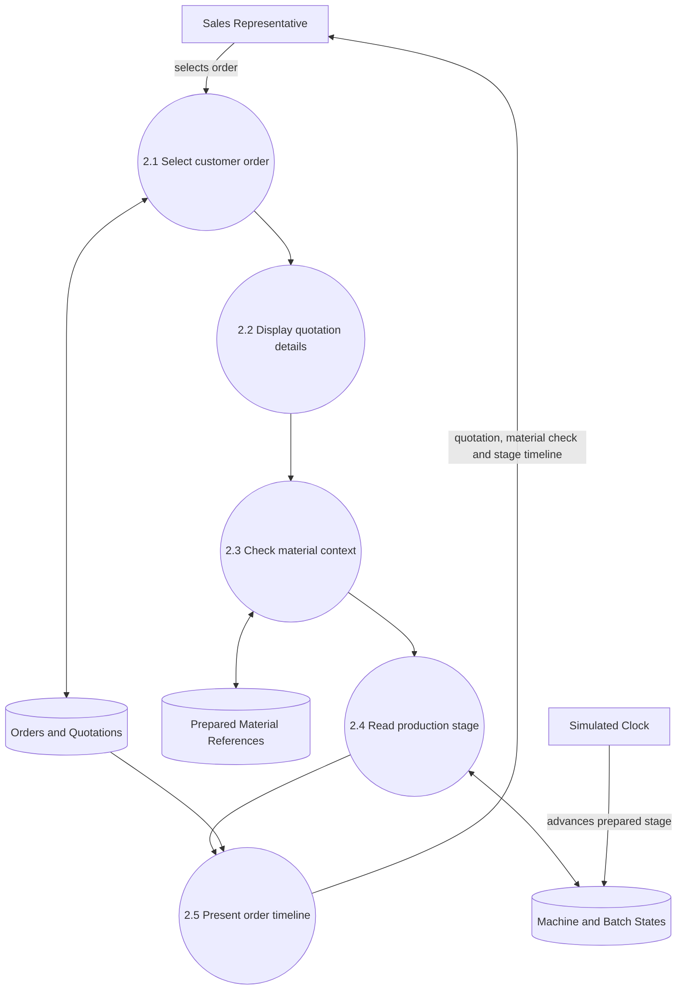

# DFD Level 2 — Order, Material Check and Production Stage

```mermaid
flowchart TD
    sales[Sales Representative]
    orderStore[(Orders and Quotations)]
    materialStore[(Prepared Material References)]
    productionStore[(Machine and Batch States)]
    clock[Simulated Clock]

    p21((2.1 Select customer order))
    p22((2.2 Display quotation details))
    p23((2.3 Check material context))
    p24((2.4 Read production stage))
    p25((2.5 Present order timeline))

    sales -->|selects order| p21
    p21 <--> orderStore
    p21 --> p22
    p22 --> p23
    p23 <--> materialStore
    p23 --> p24
    p24 <--> productionStore
    clock -->|advances prepared stage| productionStore
    p24 --> p25
    orderStore --> p25
    p25 -->|quotation, material check and stage timeline| sales
```
