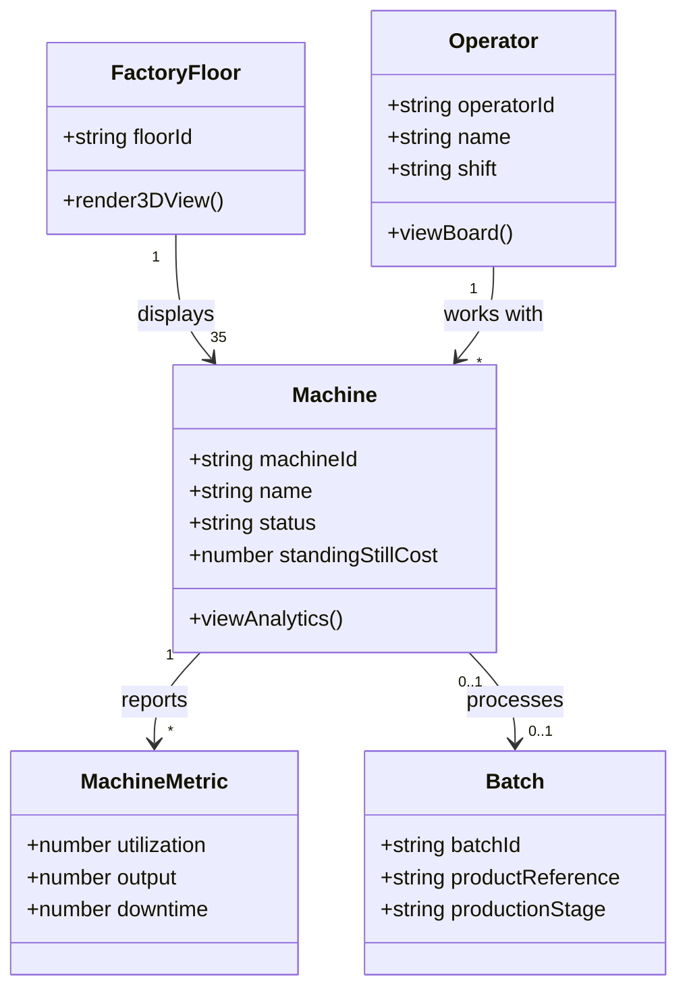

# Class Diagram — Production and Machine Domain

```mermaid
classDiagram
    class Machine {
        +string machineId
        +string name
        +string status
        +number standingStillCost
        +viewAnalytics()
    }
    class Operator {
        +string operatorId
        +string name
        +string shift
        +viewBoard()
    }
    class Batch {
        +string batchId
        +string productReference
        +string productionStage
    }
    class MachineMetric {
        +number utilization
        +number output
        +number downtime
    }
    class FactoryFloor {
        +string floorId
        +render3DView()
    }

    FactoryFloor "1" --> "35" Machine : displays
    Machine "1" --> "*" MachineMetric : reports
    Operator "1" --> "*" Machine : works with
    Machine "0..1" --> "0..1" Batch : processes
```
