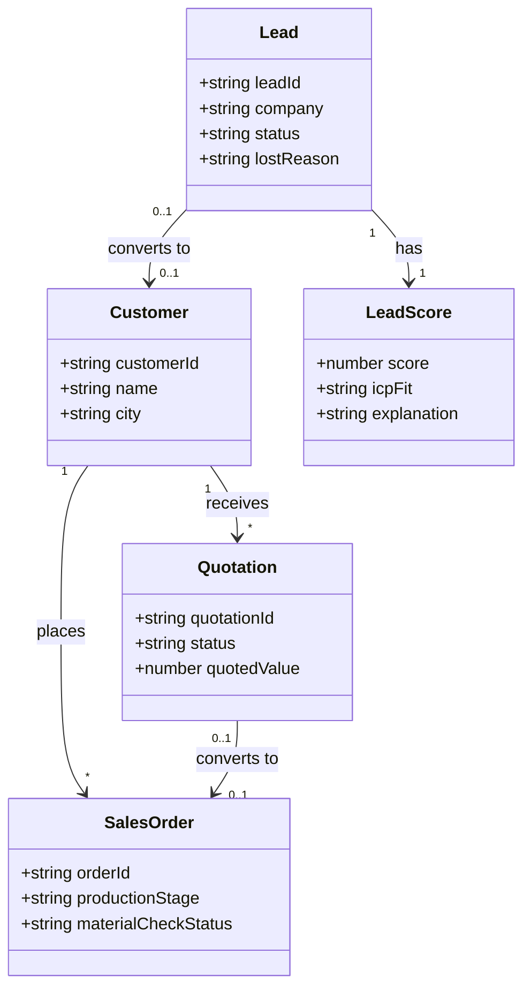

# Class Diagram — Commercial and Lead Intelligence Domain

```mermaid
classDiagram
    class Customer {
        +string customerId
        +string name
        +string city
    }
    class Quotation {
        +string quotationId
        +string status
        +number quotedValue
    }
    class SalesOrder {
        +string orderId
        +string productionStage
        +string materialCheckStatus
    }
    class Lead {
        +string leadId
        +string company
        +string status
        +string lostReason
    }
    class LeadScore {
        +number score
        +string icpFit
        +string explanation
    }

    Customer "1" --> "*" Quotation : receives
    Customer "1" --> "*" SalesOrder : places
    Quotation "0..1" --> "0..1" SalesOrder : converts to
    Lead "1" --> "1" LeadScore : has
    Lead "0..1" --> "0..1" Customer : converts to
```
