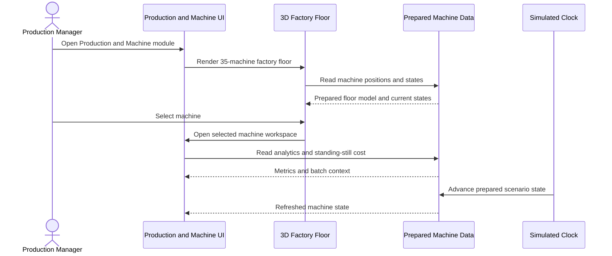

# Sequence Diagram — Machine Analytics Interaction

```mermaid
sequenceDiagram
    actor Manager as Production Manager
    participant UI as Production and Machine UI
    participant Floor as 3D Factory Floor
    participant Data as Prepared Machine Data
    participant Clock as Simulated Clock

    Manager->>UI: Open Production and Machine module
    UI->>Floor: Render 35-machine factory floor
    Floor->>Data: Read machine positions and states
    Data-->>Floor: Prepared floor model and current states
    Manager->>Floor: Select machine
    Floor->>UI: Open selected machine workspace
    UI->>Data: Read analytics and standing-still cost
    Data-->>UI: Metrics and batch context
    Clock->>Data: Advance prepared scenario state
    Data-->>UI: Refreshed machine state
```
