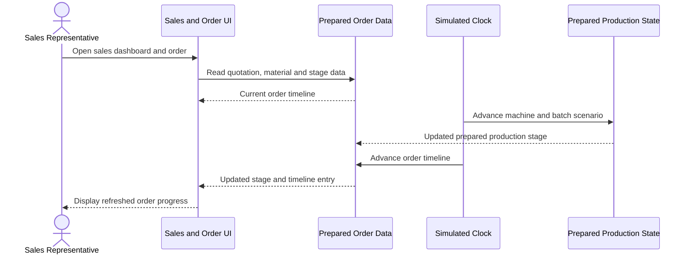

# Sequence Diagram — Simulated Order Stage Update

```mermaid
sequenceDiagram
    actor Sales as Sales Representative
    participant UI as Sales and Order UI
    participant Orders as Prepared Order Data
    participant Clock as Simulated Clock
    participant Production as Prepared Production State

    Sales->>UI: Open sales dashboard and order
    UI->>Orders: Read quotation, material and stage data
    Orders-->>UI: Current order timeline
    Clock->>Production: Advance machine and batch scenario
    Production-->>Orders: Updated prepared production stage
    Clock->>Orders: Advance order timeline
    Orders-->>UI: Updated stage and timeline entry
    UI-->>Sales: Display refreshed order progress
```
