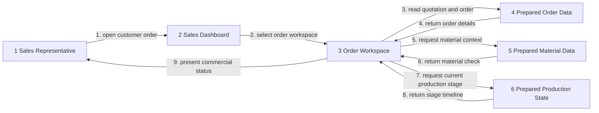

# Collaboration Diagram — Sales Order and Material Check

```mermaid
flowchart LR
    sales[1 Sales Representative]
    dashboard[2 Sales Dashboard]
    orderView[3 Order Workspace]
    orderData[4 Prepared Order Data]
    materialData[5 Prepared Material Data]
    productionData[6 Prepared Production State]

    sales -->|1. open customer order| dashboard
    dashboard -->|2. select order workspace| orderView
    orderView -->|3. read quotation and order| orderData
    orderData -->|4. return order details| orderView
    orderView -->|5. request material context| materialData
    materialData -->|6. return material check| orderView
    orderView -->|7. request current production stage| productionData
    productionData -->|8. return stage timeline| orderView
    orderView -->|9. present commercial status| sales
```
