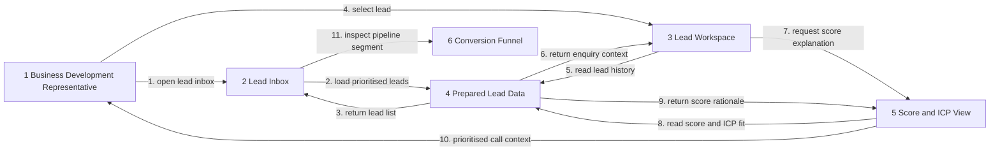

# Collaboration Diagram — Lead Scoring and Call List

```mermaid
flowchart LR
    rep[1 Business Development Representative]
    inbox[2 Lead Inbox]
    leadView[3 Lead Workspace]
    leadData[4 Prepared Lead Data]
    scoring[5 Score and ICP View]
    funnel[6 Conversion Funnel]

    rep -->|1. open lead inbox| inbox
    inbox -->|2. load prioritised leads| leadData
    leadData -->|3. return lead list| inbox
    rep -->|4. select lead| leadView
    leadView -->|5. read lead history| leadData
    leadData -->|6. return enquiry context| leadView
    leadView -->|7. request score explanation| scoring
    scoring -->|8. read score and ICP fit| leadData
    leadData -->|9. return score rationale| scoring
    scoring -->|10. prioritised call context| rep
    inbox -->|11. inspect pipeline segment| funnel
```
