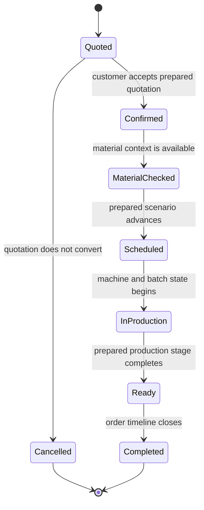

# State Chart Diagram — Sales Order Lifecycle

```mermaid
stateDiagram-v2
    [*] --> Quoted
    Quoted --> Confirmed : customer accepts prepared quotation
    Confirmed --> MaterialChecked : material context is available
    MaterialChecked --> Scheduled : prepared scenario advances
    Scheduled --> InProduction : machine and batch state begins
    InProduction --> Ready : prepared production stage completes
    Ready --> Completed : order timeline closes
    Quoted --> Cancelled : quotation does not convert
    Cancelled --> [*]
    Completed --> [*]
```
