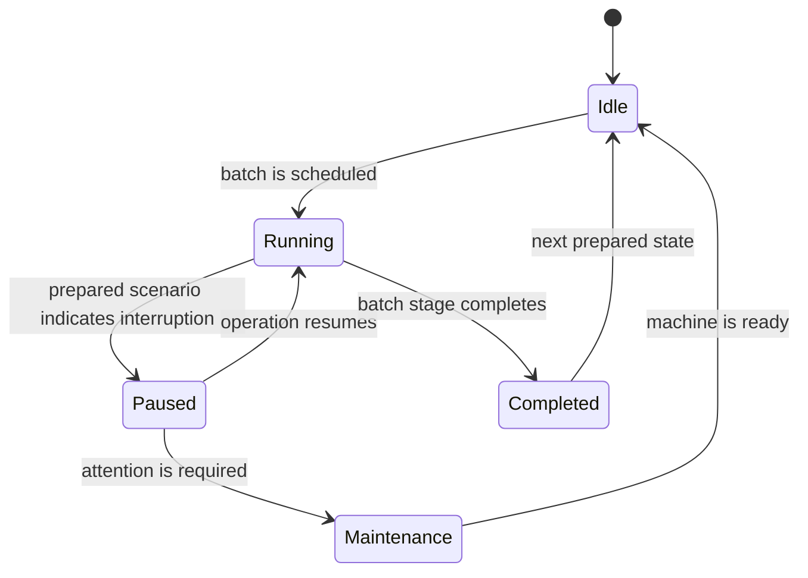

# State Chart Diagram — Machine Operational Lifecycle

```mermaid
stateDiagram-v2
    [*] --> Idle
    Idle --> Running : batch is scheduled
    Running --> Paused : prepared scenario indicates interruption
    Paused --> Maintenance : attention is required
    Maintenance --> Idle : machine is ready
    Paused --> Running : operation resumes
    Running --> Completed : batch stage completes
    Completed --> Idle : next prepared state
```
