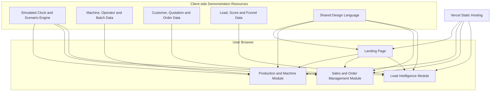

# Component Diagram — Modern Colours Demonstration Suite

```mermaid
flowchart TB
    subgraph Browser[User Browser]
        landing[Landing Page]
        machineUI[Production and Machine Module]
        salesUI[Sales and Order Management Module]
        leadUI[Lead Intelligence Module]
    end

    subgraph Resources[Client-side Demonstration Resources]
        scenario[Simulated Clock and Scenario Engine]
        machineData[Machine, Operator and Batch Data]
        salesData[Customer, Quotation and Order Data]
        leadData[Lead, Score and Funnel Data]
        design[Shared Design Language]
    end

    hosting[Vercel Static Hosting]

    hosting --> landing
    hosting --> machineUI
    hosting --> salesUI
    hosting --> leadUI
    landing --> machineUI
    landing --> salesUI
    landing --> leadUI
    scenario --> machineUI
    scenario --> salesUI
    scenario --> leadUI
    machineData --> machineUI
    salesData --> salesUI
    leadData --> leadUI
    design --> landing
    design --> machineUI
    design --> salesUI
    design --> leadUI
```
