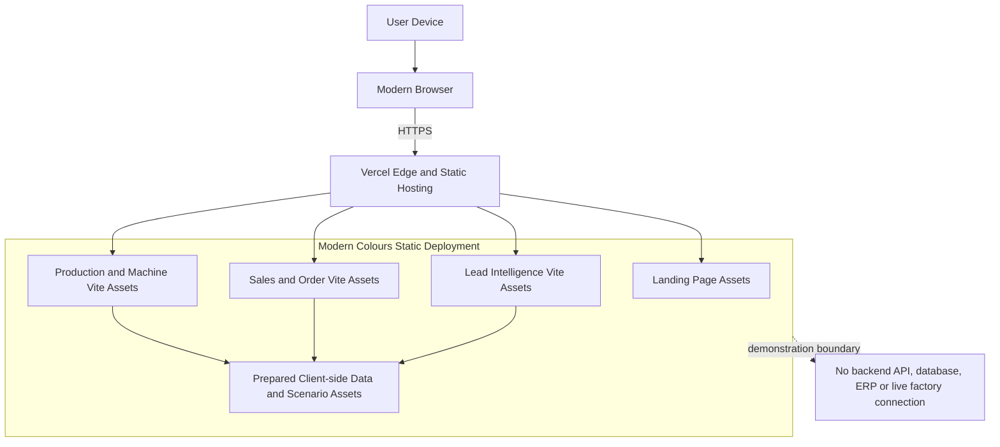

# Deployment Diagram — Static Demonstration Deployment

```mermaid
flowchart TB
    user[User Device]
    browser[Modern Browser]
    vercel[Vercel Edge and Static Hosting]

    subgraph deployment[Modern Colours Static Deployment]
        landing[Landing Page Assets]
        machine[Production and Machine Vite Assets]
        sales[Sales and Order Vite Assets]
        lead[Lead Intelligence Vite Assets]
        data[Prepared Client-side Data and Scenario Assets]
    end

    user --> browser
    browser -->|HTTPS| vercel
    vercel --> landing
    vercel --> machine
    vercel --> sales
    vercel --> lead
    machine --> data
    sales --> data
    lead --> data

    note[No backend API, database, ERP or live factory connection]
    deployment -. demonstration boundary .-> note
```
